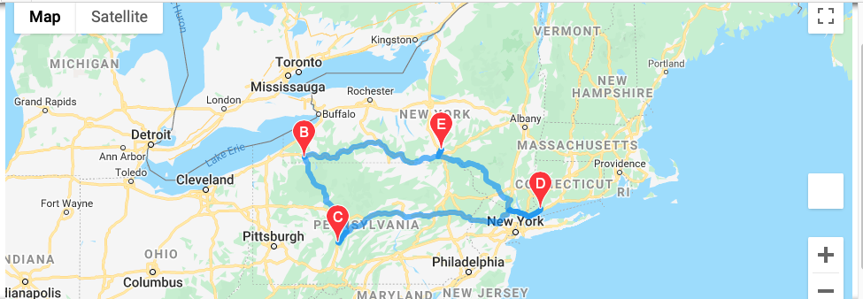

# World Weather Analysis
## Summary
### The purpose of this challenge was to analyze weather patterns around the world and offer insights to travelers who want to plan a vacation with PlanMyTrip.  The goal is to be able to provide hotel names avaialbe in difference cities along with the current weather for that location.  There are three files with various analysis done for this project: Weather Database, Vacation Search and Vacation Itinerary. 

## Weather Database
This analysis uses Open Weather Map API to pull weather information on 723 different cities around the world. The weather information that we were looking to get for these cities were:

- Maximum Temperature
- Cloudiness
- Wind Speed
- Humidity
- Current Weather Description

## Vacation Search
This folder combines the information from the weather database and combines it with Google Maps API to map out the different hotel desinations in the cities that were found with the latitude and longitude coordinates that were generated.  The figure below mapped out all the locations on the list with temperatures that range from 75 - 90 degrees farinheit. 

## Vacation Itinerary
This folder takes the hotel search information and uses the Google Maps diretictions API to create a road trip itinerary.  The figure below shows a trip with 4 cities that include: Broome, Jamestome, Altoona and Westport.

This figure below shows the current weather status for the selected cities on road trip itinerary. 

